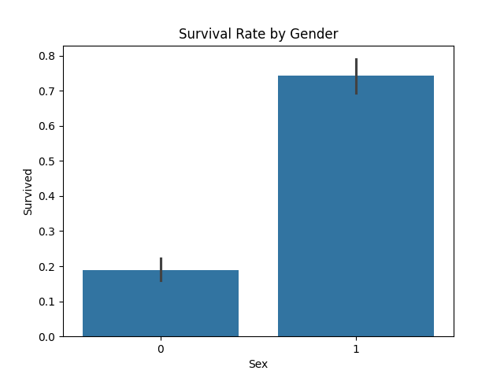

# titanic-survival-analysis.ckj（附着代码及运行过程，内容详细）
# 泰坦尼克号生存预测分析

## 项目目标
分析1912年泰坦尼克号乘客的生存率影响因素

## 数据来源
[Kaggle泰坦尼克数据集](https://www.kaggle.com/c/titanic/data)

## 分析步骤
1. 数据清洗：处理缺失值和异常值
2. 可视化分析：性别、年龄与生存率关系
3. 构建随机森林预测模型

## 主要结论
- 女性生存率是男性的4倍（74.2% vs 18.9%）
- 头等舱乘客生存率显著高于其他舱位
- 年龄对生存率的影响呈U型曲线（儿童和老人更易存活）

## 如何运行
1. 安装依赖：`pip install pandas matplotlib seaborn scikit-learn`
2. 下载本仓库代码和数据
3. 运行Jupyter Notebook：`jupyter lab titanic-analysis.ipynb`

## 可视化结果

